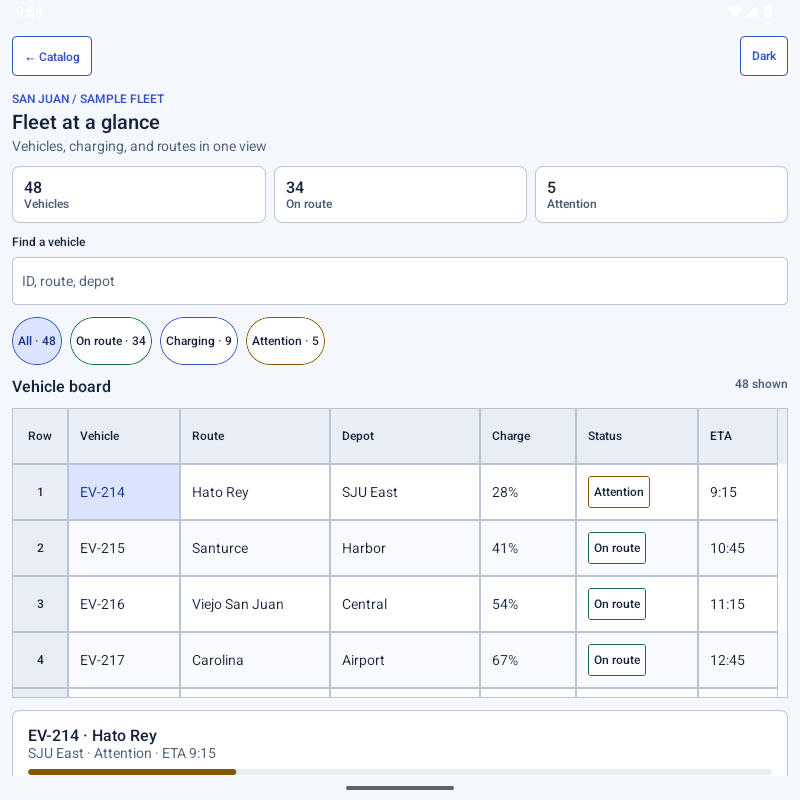

# Brace Android

An open-source Jetpack Compose design system for Android apps with forms, filters, and dense data. Brace has its own tokens, visual language, and native interaction patterns.



Explore the [live docs and Android captures](https://joelromanpr.github.io/brace-android/), or build the catalog to use two runnable examples: an electric fleet workspace and a spacecraft mission screen. Their data is fictional; the UI is captured from the Compose app.

## Availability

<!-- coverage:begin -->
**Released: 0 of 122 tracked Android items** (0 of 94 components; 0 of 28 design-system capabilities). [See the full coverage record, web mappings, and experimental work](docs/coverage.md).
<!-- coverage:end -->

The library is **in progress** and has no Maven Central release yet. The source includes tokens and `BraceTheme`, core controls, overlays, and panel navigation, select and query APIs, date and time input and ranges, data tables, and optional Blueprint icon packs. Each component's current status, Android behavior, tests, and source links are in the [coverage inventory](docs/coverage.md). Catalog screenshots do not change release status.

The long-term comparison is a [pinned Blueprint release](BLUEPRINT_BASELINE.md). Brace is independent of Palantir; license and third-party asset details are in [attribution](docs/attribution.md).

## Try the Android catalog

Use JDK 21 and Android SDK 36. Build and install the app with:

```sh
./gradlew :catalog:installDebug
```

The catalog lets you search the inventory, inspect component states, change theme, contrast, brand, density, and motion, and open the two operations examples. The [installation guide](docs/installation.md) has the supported toolchain, module coordinates, local Maven steps, and exact Gradle dependency snippets. There is no public version to fetch from Maven Central yet.

## Start building

```kotlin
var projectName by rememberSaveable { mutableStateOf("") }

BraceTheme {
    Column {
        BraceTextField(projectName, { projectName = it }, label = "Project name")
        BraceButton("Save", onClick = { save(projectName) })
    }
}
```

Read the [theming guide](docs/theming.md), [component guides](docs/core-components.md), [table guide](docs/table-viewport.md), [copying guide](docs/table-copying.md), [editing guide](docs/table-editing.md), and [compatibility policy](docs/compatibility.md). The [coverage inventory](inventory/blueprint-components.json) is machine-readable; the [roadmap](ROADMAP.md) tracks the next slices.

Contributions are welcome. See [CONTRIBUTING](CONTRIBUTING.md), [GOVERNANCE](GOVERNANCE.md), [SECURITY](SECURITY.md), and [SUPPORT](SUPPORT.md). Brace is licensed under [Apache-2.0](LICENSE).
